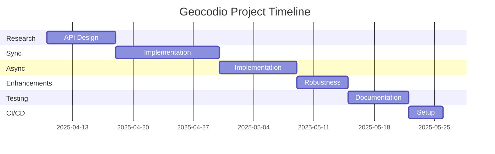
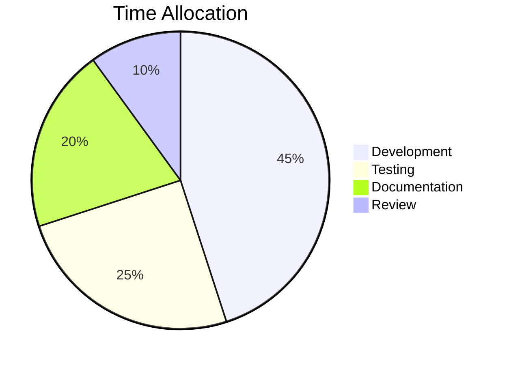
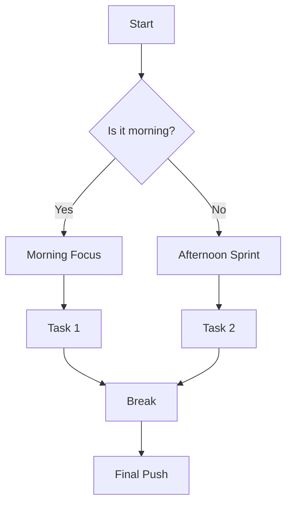
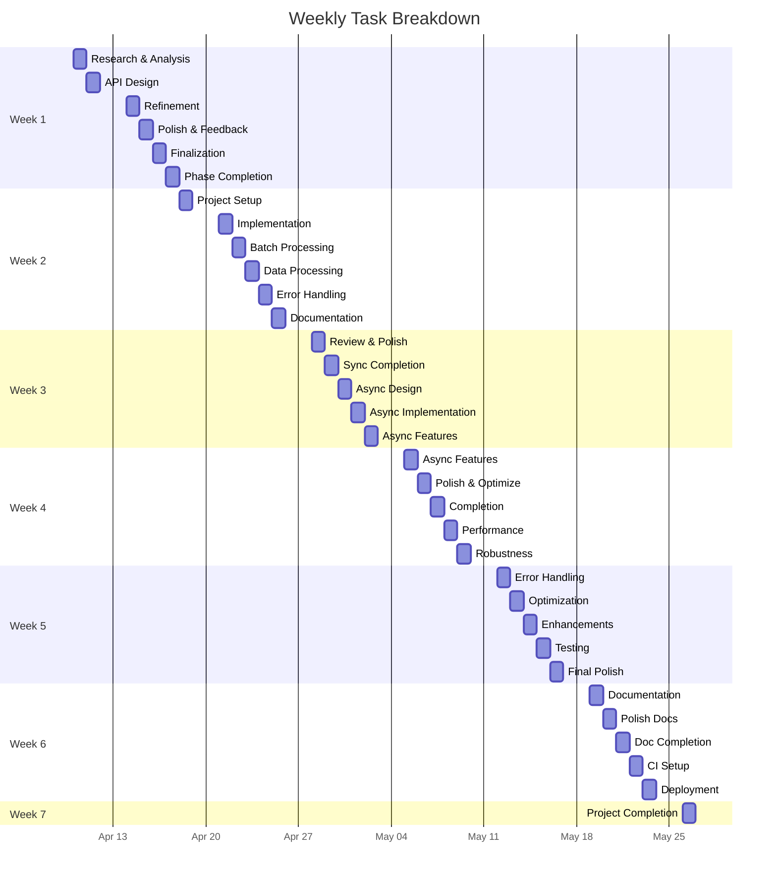
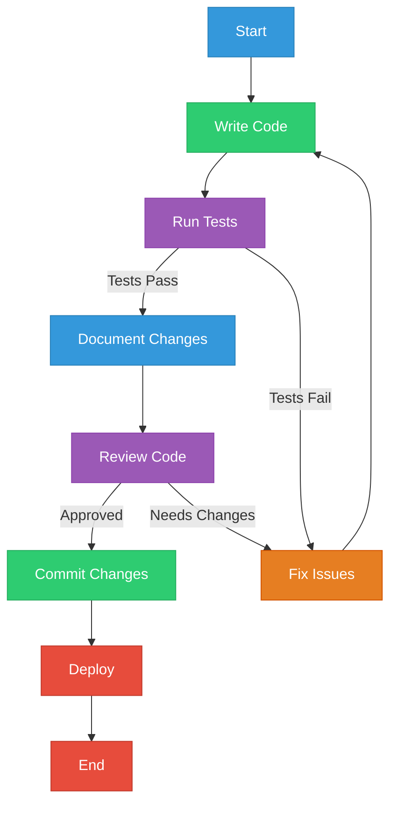
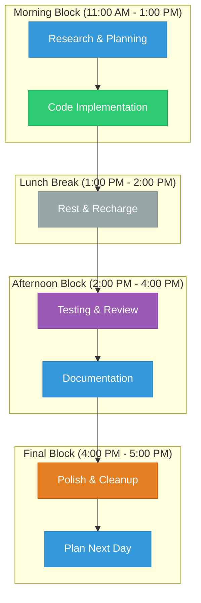

# Geocodio Python Library Visual Timeline 🎨

## Project Overview
```
Start: April 10, 2025
End:   May 26, 2025
Total: 46 days (excluding weekends)
```

## Project Timeline Visualization


## Phase Progress 🎯
```
🔵 Research & API Design (8 days)
[░░░░░░░░] 0%

🟢 Synchronous Implementation (12 days)
[░░░░░░░░░░░░] 0%

🟡 Asynchronous Implementation (9 days)
[░░░░░░░░░] 0%

🟠 Enhancements & Robustness (6 days)
[░░░░░░] 0%

🟣 Testing & Documentation (7 days)
[░░░░░░░] 0%

🔴 CI/CD Setup (4 days)
[░░░░] 0%
```

## Time Allocation


## Daily Workflow


## Weekly Breakdown 📅


## Development Process


## Daily Progress Tracker


## Daily Progress Tracker 📊

### Today's Focus
```
🕚 11:00 - 12:30 | Morning Focus
[ ] Task 1: [░░░░░░░░░░] 0%
    - Subtask 1.1 [ ]
    - Subtask 1.2 [ ]
    - Subtask 1.3 [ ]

🕧 12:30 - 13:00 | Break & Refresh
[ ] Stretch
[ ] Hydrate
[ ] Quick Walk

🕐 13:00 - 14:30 | Afternoon Sprint
[ ] Task 2: [░░░░░░░░░░] 0%
    - Subtask 2.1 [ ]
    - Subtask 2.2 [ ]
    - Subtask 2.3 [ ]

🕝 14:30 - 15:00 | Break & Stretch
[ ] Move Around
[ ] Snack
[ ] Deep Breath

🕒 15:00 - 16:30 | Final Push
[ ] Task 3: [░░░░░░░░░░] 0%
    - Subtask 3.1 [ ]
    - Subtask 3.2 [ ]
    - Subtask 3.3 [ ]

🕟 16:30 - 17:00 | Wrap-up & Plan Tomorrow
[ ] Review Today's Progress
[ ] Celebrate Wins
[ ] Plan Tomorrow
```

### Task Progress Indicators
```
🎯 High Priority
📝 Documentation
💻 Development
🧪 Testing
🔍 Review
🎨 Design
```

### Daily Checklist
```
Morning Prep:
[ ] Review Today's Goals
[ ] Set Up Workspace
[ ] Clear Distractions
[ ] Start Timer

Work Blocks:
[ ] Complete Subtask 1.1
[ ] Complete Subtask 1.2
[ ] Complete Subtask 1.3
[ ] Take Break
[ ] Complete Subtask 2.1
[ ] Complete Subtask 2.2
[ ] Complete Subtask 2.3
[ ] Take Break
[ ] Complete Subtask 3.1
[ ] Complete Subtask 3.2
[ ] Complete Subtask 3.3

End of Day:
[ ] Update Progress
[ ] Celebrate Wins
[ ] Plan Tomorrow
[ ] Clean Workspace
```

### Pomodoro Progress 🍅
```
Session 1: [░░░░░░░░░░] 0%
    - Focus: Task 1
    - Start: 11:00
    - End: 11:25

Session 2: [░░░░░░░░░░] 0%
    - Focus: Task 1
    - Start: 11:30
    - End: 11:55

Session 3: [░░░░░░░░░░] 0%
    - Focus: Task 2
    - Start: 13:00
    - End: 13:25

Session 4: [░░░░░░░░░░] 0%
    - Focus: Task 2
    - Start: 13:30
    - End: 13:55

Session 5: [░░░░░░░░░░] 0%
    - Focus: Task 3
    - Start: 15:00
    - End: 15:25

Session 6: [░░░░░░░░░░] 0%
    - Focus: Task 3
    - Start: 15:30
    - End: 15:55
```

### Progress Celebration Points 🎉
```
Small Wins:
[ ] Completed a subtask
[ ] Fixed a bug
[ ] Wrote documentation
[ ] Passed a test
[ ] Made progress on main task

Big Wins:
[ ] Completed a full task
[ ] Reached a milestone
[ ] Solved a complex problem
[ ] Finished a phase
```

## Key Milestones 🎯