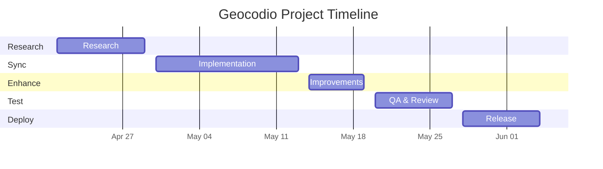
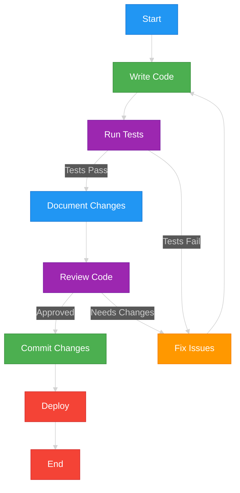
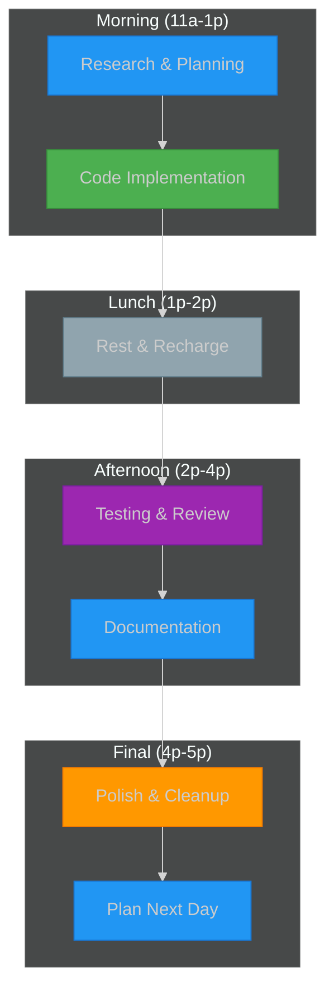

# Geocodio Python Library Visual Timeline 🎨

## Project Overview
A visual guide to track our progress through the Geocodio Python library implementation.

## Color Guide
- 🔵 Blue (Research): Documentation, planning, analysis
- 🟢 Green (Sync): Writing code, implementation, commits
- 🟡 Yellow (Async): Async operations
- 🟠 Orange (Enhance): Fixing issues, improvements
- 🟣 Purple (Test): Testing, review, quality assurance
- 🔴 Red (Deploy): Deployment, final steps
- ⚪ Gray (Break): Rest periods

## Project Timeline

## Development Process

## Daily Progress Tracker

## Progress Tracking
- Research Phase: [░░░░░░░░░░] 0%
- Sync Implementation: [░░░░░░░░░░] 0%
- Async Implementation: [░░░░░░░░░░] 0%
- Enhancements: [░░░░░░░░░░] 0%
- Testing: [░░░░░░░░░░] 0%
- CI/CD Setup: [░░░░░░░░░░] 0%

## Daily Checklist
- [ ] Morning standup
- [ ] Update progress bars
- [ ] Complete planned tasks
- [ ] Document changes
- [ ] Review tomorrow's plan
- [ ] Celebrate today's wins! 🎉